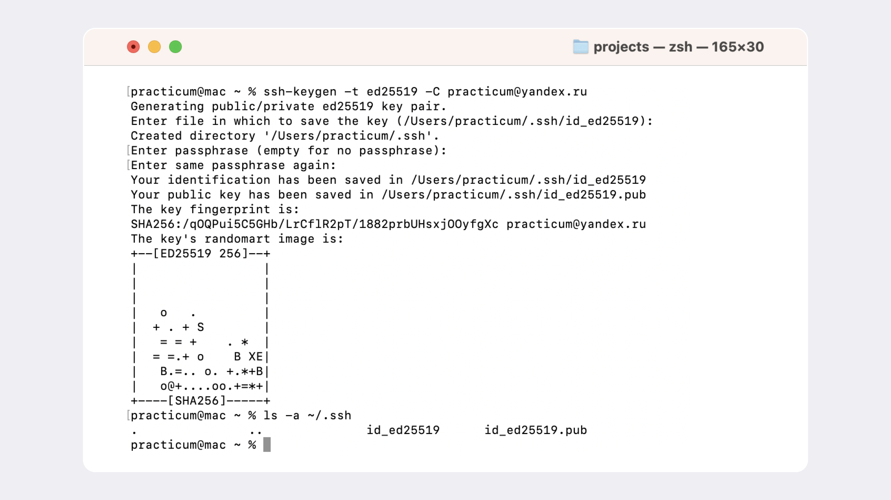
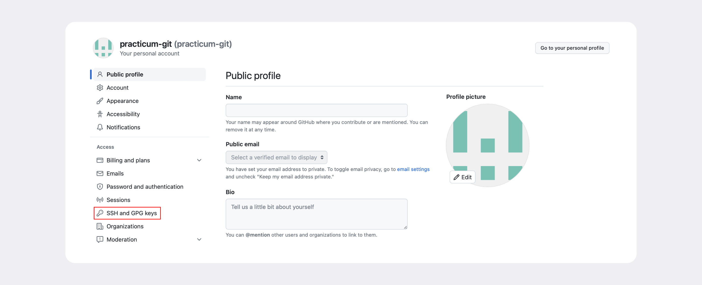
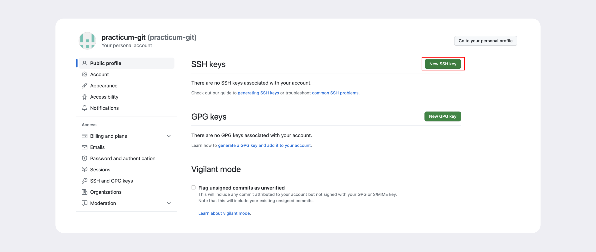
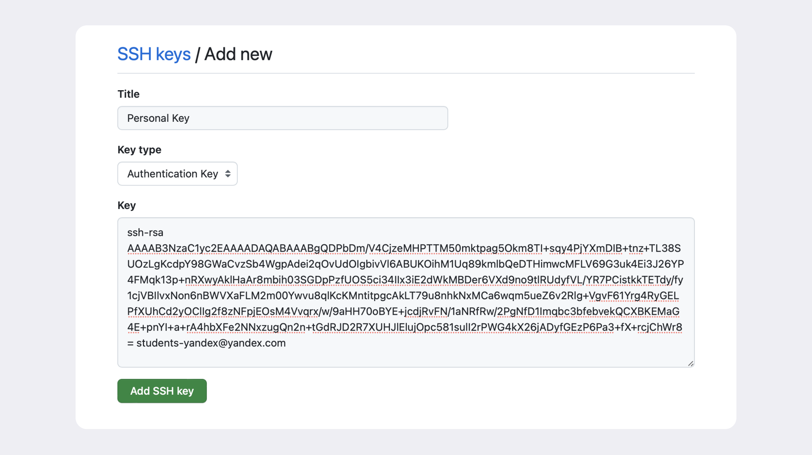
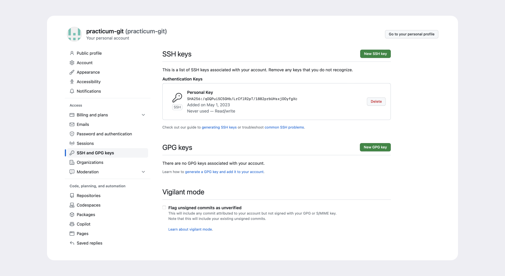
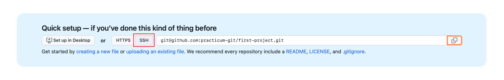

# Git и Github

## Что такое SSH. Генерируем SSH-ключ

``Один из наиболее распространённых сетевых протоколов — SSH (от англ. Secure Shell Protocol).`` Он обеспечивает безопасный обмен данными в сети. С помощью этого протокола можно получать данные с удалённого компьютера или отправлять их на него. Трафик шифруется, поэтому протокол безопасен.

```
SSH — протокол, который обеспечивает безопасный обмен данными в сети и использует для этого ключи.

SSH-ключ состоит из двух частей — публичной и приватной. Публичный ключ зашифрует данные, а приватный — расшифрует. Приватным ключом ни в коем случае нельзя делиться, иначе любой сможет расшифровать все ваши секреты!

```

### SSH использует пару ключей для обеспечения безопасности — публичный и приватный: 

`Приватный ключ (англ. private key) ` - хранится только на вашем компьютере и не должен передаваться кому-либо ещё. Он используется для расшифровки данных.
`Публичный ключ (англ. public key)` доступен всем и используется для шифрования данных. Они могут быть расшифрованы парным приватным ключом.

## Проверка наличия SSH-ключа

Прежде чем генерировать SSH-ключи, убедитесь, что у вас их ещё нет. По умолчанию директория с SSH-ключами находится в домашней директории пользователя. Перейдите в неё.

```
$ cd ~ # перешли в домашнюю директорию 
```

Обычно SSH-ключи находятся в директории .ssh/. Проверить наличие этой директории и файлов в ней можно с помощью следующей команды.

```
$ ls -la .ssh/ # вывели список созданных ключей 
```

Если папка пустая или её нет, всё в порядке. 

Если есть файлы с похожими названиями, SSH-ключи уже создавались:
- id_dsa.pub;
- id_ecdsa.pub;
- id_ed25519.pub;
- id_rsa.pub.

Если вы не создавали эти файлы, удалите их все.

### Инструкция по генерации SSH-ключа

1. Для генерации SSH-пары можно использовать программу ssh-keygen. Откройте терминал и введите следующую команду.
```
$ ssh-keygen -t ed25519 -C "электронная почта, к которой привязан ваш аккаунт на GitHub" 
```
2. Используйте электронную почту, к которой привязан ваш GitHub-аккаунт. Если вы видите сообщение об ошибке, то, скорее всего, ваша система не поддерживает алгоритм шифрования ed25519. Ничего страшного: используйте другой алгоритм.

```
$ ssh-keygen -t rsa -b 4096 -C "электронная почта, к которой привязан ваш аккаунт на GitHub" 
```

3. После ввода отобразится такое сообщение.
```
> Generating public/private rsa key pair. # сгенерированы публичный и приватный ключи 
```

4. Укажите место хранения ключей. Простой вариант — сделать домашний каталог пользователя путём по умолчанию. Для этого нажмите Enter.
```
> Enter a file in which to save the key (C:\Users\<имя_пользователя>\.ssh\):[Press enter] 
```

5. Теперь в указанной директории появится пара ключей.
Программа запросит кодовую фразу (англ. passphrase) для доступа к SSH-ключу. Вы можете оставить поле пустым. Для этого нажмите Enter, а затем ещё раз Enter для подтверждения.

```
> Enter passphrase (empty for no passphrase): [Type a passphrase]
> Enter same passphrase again: [Type passphrase again] 
```

Чтобы  проверить, что ключи действительно сгенерировались нужно вызвать  команду:
```
ls -a ~/.ssh 
```

На экране должны появиться два файла — один с расширением .pub, другой — без. 

```
Файл в .pub — публичный, им можно делиться с веб-сайтами или коллегами. Файл без расширения .pub — приватный. Ни в коем случае не передавайте его никому! 
```
Вся последовательность действий в консоли показана на скриншоте ниже.


## Как привязать SSH-ключ к GitHub

### Инструкция по связыванию SSH-ключа и GitHub-аккаунта

После выполнения команды ssh-keygen в соотвествующей директории ~/.ssh будет создано два файла — id_ed25519 и id_ed25519.pub (или id_rsa и id_rsa.pub — в зависимости от того, какой алгоритм вы использовали):

- id_ed25519/id_rsa — приватный ключ (файл без .pub в конце). Ни в коем случае не копируйте его и не делитесь им.
- id_ed25519.pub/id_rsa.pub — публичный ключ (на это указывает расширение .pub).

Скопируйте содержимое файла с публичным ключом в буфер обмена.
### для Windows
```
# скопировать содержимое ключа в буфер обмена:
$ clip < ~/.ssh/id_rsa.pub
# для ed25519:
$ clip < ~/.ssh/id_ed25519.pub
```

Если clip не сработает, выведите содержимое файла с помощью `cat ~/.ssh/id_rsa.pub или cat ~/.ssh/id_ed25519.pub`` и скопируйте вывод в буфер обмена из консоли.

2. Перейдите на GitHub и выберите пункт Settings (англ. «настройки») в меню аккаунта.


3. В меню слева нажмите на пункт SSH and GPG keys.


4. В открывшейся вкладке выберите New SSH key (англ. «новый SSH-ключ»).



5. В поле Title (англ. «заголовок») напишите название ключа. Например, Personal key (англ. «личный ключ»).
6. В поле Key type (англ. «тип ключа») должно быть Authentication Key (англ. «ключ аутентификации»).
7. В поле Key скопируйте ваш ключ из буфера обмена.


8. Нажмите на кнопку Add SSH key (англ. «добавить SSH-ключ»).


9. Проверьте правильность ключа с помощью следующей команды.
```
$ ssh -T git@github.com 
```
10. GitHub, появится похожее предупреждение.
```
The authenticity of host 'github.com (140.82.121.4)' can't be established. ED25519 key fingerprint is SHA256:+DiY3wvvV6TuJJhbpZisF/zLDA0zPMSvHdkr4UvCOqU. This key is not known by any other names. Are you sure you want to continue connecting (yes/no/[fingerprint])? 
```

Это предупреждение сообщает, что вы никогда не соединялись с сервером GitHub. Поэтому Git не может гарантировать, что сервер является тем, за кого он себя выдаёт.
Для подтверждения подлинности сервер генерирует и публикует ключи SHA256. Вы можете проверить ключи GitHub по этой ссылке. Если ключ в предупреждении совпадает с тем, что вы видите на сайте, значит, сервер является действительным. Введите yes, чтобы продолжить. Вы увидите приветствие на экране.

```
Hi %ВАШ_АККАУНТ%! You've successfully authenticated, but GitHub does not provide shell access. 

```

## Привязать удалённый репозиторий к локальному — git remote add

Перейдите на страницу удалённого репозитория, выберите тип SSH и скопируйте URL. Кнопка справа позволит сделать это мгновенно.



Откройте консоль, перейдите в каталог локального репозитория и введите команду git remote add (от англ. remote — «удалённый» и add — «добавить»).
```
$ cd ~/dev/first-project
$ git remote add origin git@github.com:%ИМЯ_АККАУНТА%/first-project.git
```

Команде необходимо передать два параметра: имя удалённого репозитория и его URL. В качестве имени используйте слово origin. А URL вы скопировали со страницы удалённого репозитория.

`origin (англ. «источник») `— стандартный псевдоним, с помощью которого можно обращаться к главному удалённому репозиторию (обычно такой репозиторий один). Это значительно упрощает работу.

## Убедиться, что репозитории связаны, — git remote -v

Убедиться, что всё работает, можно с помощью следующей команды.

```
$ git remote -v
origin    git@github.com:%ИМЯ_АККАУНТА%/%ИМЯ-ПРОЕКТА%.git (fetch)
origin    git@github.com:%ИМЯ_АККАУНТА%/%ИМЯ-ПРОЕКТА%.git (push) 

```

В выводе вы должны увидеть две строчки, аналогичные тем, что показаны выше.
Флаг `-v` — короткая форма флага `--verbose` (англ. «подробный»). Он позволяет показать больше информации в выводе.


## Синхронизация локального и удалённого репозиториев

Самая первая ветка в репозитории появляется автоматически и называется main (англ. «основная») или master. Её имя нужно указывать при отправке коммитов на удалённый репозиторий или при получении их из него.

### Отправить изменения на удалённый репозиторий — git push

Загрузить содержимое локального репозитория на GitHub  - команда `git push `(от англ. push — «толкать»).

`В первый раз эту команду нужно вызвать с флагом -u и параметрами origin (имя удалённого репозитория) и main или master `(название текущей ветки). 

Флаг -u свяжет локальную ветку с одноимённой удалённой. Как вы связывали локальный и удалённый репозитории в предыдущем уроке, так же и здесь нужно дополнительно связать ветки.

```
$ git push -u origin main # Если команда приведёт к ошибке, попробуйте # заменить main на master. 
```

При взаимодействии с удалёнными репозиториями Git выводит в консоль отладочную информацию: количество объектов (файлов), которые отправляются на сервер, информацию о прогрессе сжатия и записи и так далее.
Если вы указывали кодовую фразу при настройке SSH-ключей, её нужно будет ввести.
Зайдите в репозиторий first-project на GitHub. Вы увидите, что в репозитории появились файлы с изменениями.


В дальнейшем при работе с удалённым репозиторием флаг -u можно опустить и писать просто git push.