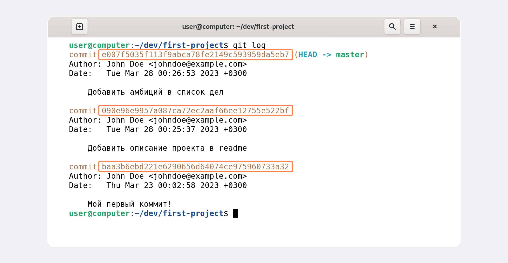
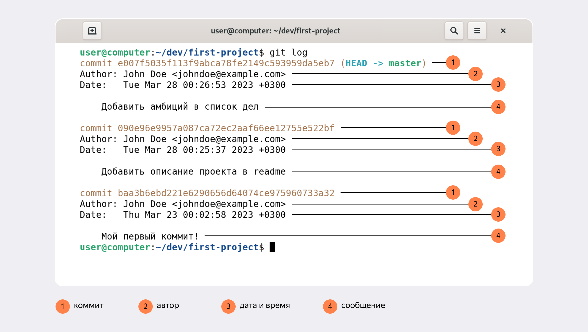

# Хеш — идентификатор коммита
___

В процессе работы с Git  часто встречается понятие «хеш коммита». При вызове комманды git log и выводе истории  коммитов появляется такое сообщение.


## Что такое хеш. Хеширование коммитов

``Хеширование`` (от англ. hash, «рубить», «крошить», «мешанина») — это способ преобразовать набор данных и получить их «отпечаток» (англ. fingerprint).

**Информация о коммите** — это набор данных: когда был сделан коммит, содержимое файлов в репозитории на момент коммита и ссылка на предыдущий, или родительский (англ. parent), коммит.

Git хеширует (преобразует) информацию о коммите с помощью алгоритма SHA-1 (от англ. Secure Hash Algorithm — «безопасный алгоритм хеширования») и получает для каждого коммита свой уникальный хеш — результат хеширования.

Обычно хеш — это короткая (40 символов в случае SHA-1) строка, которая состоит из цифр 0—9 и латинских букв A—F (неважно, заглавных или строчных). Она обладает следующими важными свойствами:

- если хеш получить дважды для одного и того же набора входных данных, то результат будет гарантированно одинаковый;
- если хоть что-то в исходных данных поменяется (хотя бы один символ), то хеш тоже изменится (причём сильно).

Чтобы убедиться в этом, можно поэкспериментировать с SHA-1 на этом сайте — попробуйте ввести в поле input (англ. «ввод») разные символы, слова или предложения и понаблюдайте, как меняется хеш в поле output (англ. «вывод»).

### Хеш — основной идентификатор коммита

Git хранит таблицу соответствий хеш → информация о коммите. Если вы знаете хеш, вы можете узнать всё остальное: автора и дату коммита и содержимое закоммиченных файлов. Можно сказать, что хеш — основной идентификатор коммита.

При работе с Git хеши будут встречаться вам регулярно. Их можно будет передавать в качестве параметра разным Git-командам, чтобы указать, с каким коммитом нужно произвести то или иное действие.

Все хеши и таблицу хеш → информация о коммите Git сохраняет в служебные файлы. Они находятся в скрытой папке .git в репозитории проекта.


## Из каких элементов состоит лог

### Элементы описания коммита
После вызова git log появляется список коммитов.



Разберём элементы, из которых состоит описание:
- строка из цифр и латинских букв после слова commit — это хеш коммита;
- Author — имя автора и его электронная почта;
- Date — дата и время создания коммита;
- в конце находится сообщение коммита.

Исходный код самого Git тоже хранится в Git-репозитории (тут уместно вспомнить про курицу и яйцо). Вот так выглядит описание самого первого коммита в репозитории Git.

```
commit e83c5163316f89bfbde7d9ab23ca2e25604af290
Author: Linus Torvalds <torvalds@linux-foundation.org>
Date:   Thu Apr 7 15:13:13 2005 -0700

    Initial revision of "git", the information manager from hell 

```

Что означает:
- Автор проекта Git — Linus Torvalds
- Git появился в апреле 2005 года
- Автор описал Git как the information manager from hell


### Получить сокращённый лог — git log --oneline
Получить сокращённый лог можно с помощью команды git log с флагом --oneline (англ. «одной строкой»). В терминале появятся только первые несколько символов хеша каждого коммита и их комментарии.

Получить сокращённый лог можно с помощью команды **git log с флагом --oneline** (англ. «одной строкой»). В терминале появятся только первые несколько символов хеша каждого коммита и их комментарии.

Сокращённый лог полезен, если в репозитории уже много коммитов — например, сотни или тысячи. В этом случае можно быстро найти нужный по описанию.
Сокращённый хеш (то есть первые несколько символов полного) можно использовать точно так же, как и полный. Для этого команда git log --oneline автоматически подбирает такую длину сокращённых хешей, чтобы они были уникальными в пределах репозитория и Git всегда мог понять, о каком коммите идёт речь.


```
Обратите внимание: если выход из просмотра логов не произошёл автоматически, 
нажмите клавишу Q (от англ. Quit — «выйти») в английской раскладке клавиатуры.
```